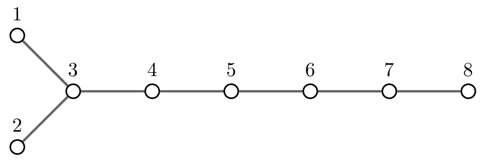

# Precise matchings

Construction of precise matchings for the local homology of finite and affine Artin groups.

## Installation ##
It is enough to clone this repository. No installation is needed.
After cloning, you can run the test suite via `python test.py` or `pypy test.py`.

Requirements: Python 2.7, [NZMATH](https://pypi.python.org/pypi/NZMATH/1.0.1).

## Usage ##
```bash
python check_matching.py A|B|D|E|F|H|tA|tB|tC|tD|tE|tF|tG|tI n [d] [-v|-vv]
```

The first argument is the Coxeter type, where `t` stands for "tilde" and denotes affine types.

The second argument `n` (integer >= 1) is the size of the Coxeter system.

The third optional argument `d` (integer >= 2) indicates which local component to check.
If `d` is not specified, all relevant local components are checked.

Optional arguments `-v` and `-vv` ask for more output.

By default, the program constructs a matching and checks that it is precise. It also computes the ranks of the boundary matrices of the Morse complex (they coincide with the ranks of the d-localized homology groups).
With the `-v` option, critical simplices (with their d-weights) are also printed.
With the `-vv` option the matching itself is also printed, together with the non-zero incidence numbers between critical simplices in the Morse complex.

### Example: D_8, d=4 ###



```bash
python check_matching.py D 8 4 -v
```

    type: D
    n=8
    *** d=4 ***
    Critical simplices:
    (1, 2, 3, 6, 7) 	w=1
    (2, 3, 6, 7) 	w=0
    (2, 3, 5, 6, 7) 	w=1
    (1, 3, 6, 7) 	w=0
    (1, 2, 3, 4, 5, 6, 7) 	w=3
    (1, 2, 3, 4, 6, 7) 	w=2
    (1, 3, 4, 6, 7) 	w=1
    (1, 2, 3, 4, 6, 7, 8) 	w=3
    (1, 2, 3, 5, 6, 7) 	w=2
    (1, 2, 3, 4, 5, 6, 7, 8) 	w=4
    The matching is precise.
    Ranks (from 1-dim to 8-dim): [0, 0, 0, 0, 2, 1, 1, 1]

## Licence ##
This project is licensed under the [GNU General Public License v3.0](https://github.com/giove91/precise-matchings/blob/master/LICENSE).
